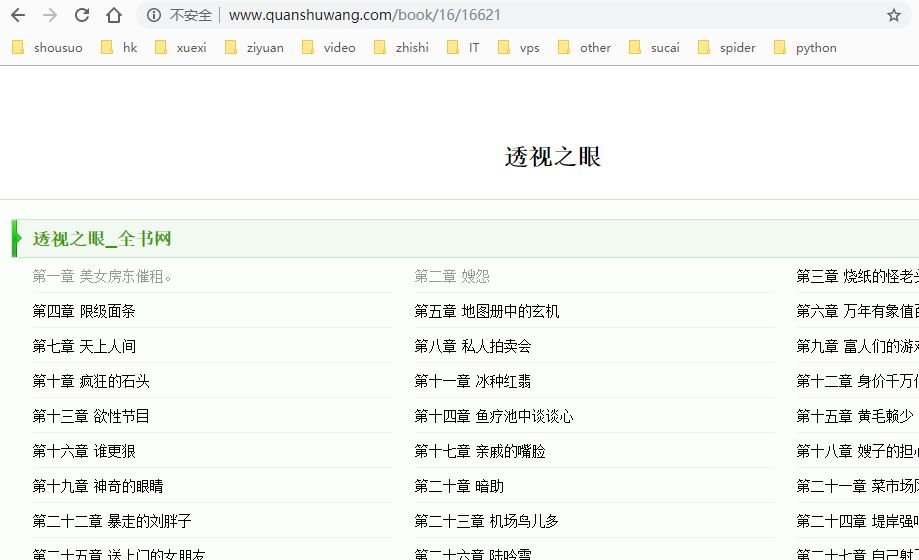
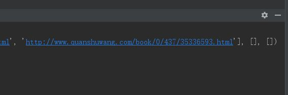
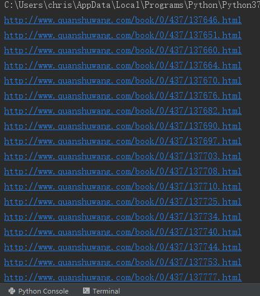
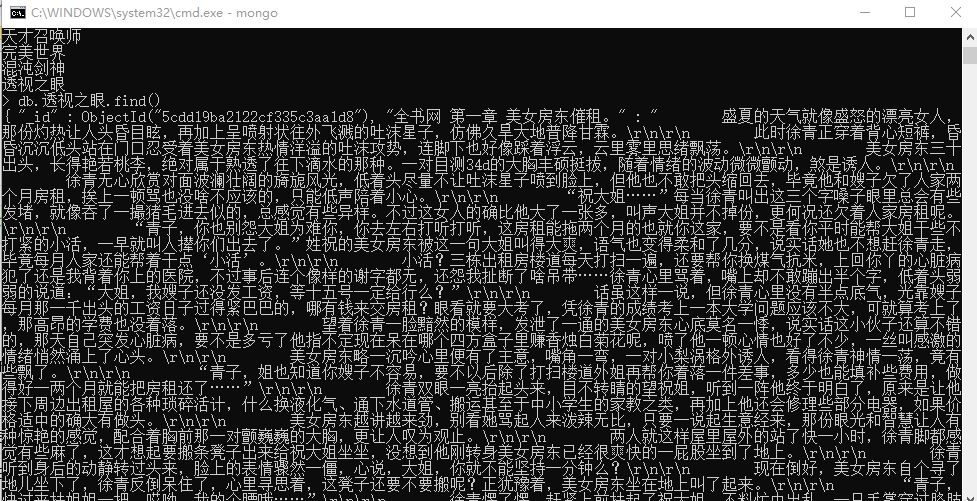

# quanshuwang
爬取全书网的小说
### 准备环境：

requests
xpath
Chrome

### 分析过程：
打开全书网的官网，找一个喜欢看的小说进入目录界面



首先我们先请求这个网址，得到网页源码

```
    try:
        session = requests.Session()
        response = session.get(url, headers = headers)
        if response.status_code == 200:
            response.encoding = 'gbk'  # 把编码换成gbk，其他的都不支持
            re_content = re.sub('<br />', '', response.text)  # 把里面的换行全换掉
            return re_content
    except requests.ConnectionError:
        pass
```

然后通过解析函数把里面所有的章节url解析出来，这里返回了3个参数，因为后面两个参数解析正文的时候需要用到，解析函数如下

```
def get_parse_xpath(html):
    try:
        book_html = etree.HTML(html)
        #解析出所有章节的url
        parse_url = book_html.xpath('//div[contains(@class,"dirconone")]/li/a/@href')
        #解析出每一章的文本
        parse_text = book_html.xpath('//div[@id="content"]/text()')
        #解析出每一章的标题
        parse_title = book_html.xpath('//div[@class="bookInfo"]/h1/strong/text()')
        #parse_url.reverse()#倒叙
        return parse_url, parse_title, parse_text #返回三个列表的元祖结构
    except Exception as e:
        print(e)
```

这里看看输出的结果是一个元祖，元祖里面有三个列表，分别对应返回的链接，正文，标题



这里已经拿到了所有章节的url了，接下来我们可以继续使用requests请求它们，遍历一下所有的url看看



既然我们已经做好了请求模块，就可以继续调用这个请求模块

接着调用解析模块，对每个url进行解析并提取正文

正文太多就不放出来了

爬取了所需要的数据之后就可以保存入库了

这里我选择mongo，mongo相对其他数据库简单一点

存储的是json格式

这里放上我保存数据的截图



有需要的朋友可以试试，欢迎挑错和改善！！！
